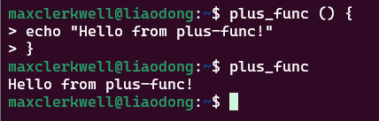
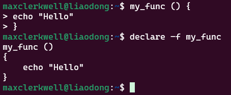

# PP2

## Goal
This practical exercise is supposed to teach you how the shell-interface to your operating system works. 
The shell is a program, that get's delivered with your OS' distribution. 
Its purpose is to connect your keyboard+printer combination (Terminal-Emulator with Keyboard and Screen in modern set-ups) to the kernel, which controls your hardware. 
While doing this exercise, you'll gradually explore your systems capabilities on quite a low level, making you become a basic linux user.
Even though, there are many different _shells_ on the market, one of the more commonly used is the `Bourne Again Shell`, better know as `bash`. 
If you didn't configure it otherwise, _Ubuntu_ and _Debian_ are delivered with `bash`, so you don't have to install anything else!

In order to succeed with all tasks you'll need access to a Linux-machine. 
This can be done in one of 3 ways:
a) You already have a linux machine, whether it's a raspberry pi you have in your dorm or a full blown laptop with a linux distribution installed
b) You have a Windows machine, but you have installed the [Windows Subsystem for Linux (WSL)](https://learn.microsoft.com/en-us/windows/wsl/install)
c) You have neither nor. In that case you'll have to contact the [Lab for Softwaretechnology](https://www.thga.de/forschung/elektro-und-informationstechnik/labore/softwaretechnik) and make an appointment. They can grant you access to a Linux Machine. 

> I strongly recommend getting a raspberry pi or an old maschine to run a full distro at home!

**Important:** Start a stopwatch when you begin and work uninterruptedly for 90 minutes. Once time is up, stop immediately and document the point where you had to pause.

---

## Workflow
Remember the standard workflow. 
If in doubt, revisit [PP1](https://github.com/MaxClerkwell/PP1)

1. **Fork** the repository
2. **Modify and Commit** your solution
3. **Submit your link for Review**

If you get stuck, use the [Github-Discussions of this Repository](https://github.com/MaxClerkwell/PP2/discussions)!

## Tasks

### Task 1: Understanding the Prompt
When your machine is ready to receive a command from you, it'll tell you. 
The OS does that by sending a line of text to your terminal, called _The Prompt_.
To prompt someone means: 
> "​to incite or move them to action, or to assist them by suggesting something they may have forgotten or not considered."
An example of this is given in the picture below. 
Prompts may look different on different machines and can be configured individually - we'll see how in a later exercise.
Mine shows my `<username>@<hostname>`, then uses a colon `:`, then a path which is `~` in case of the picture and a finalizing `$` which indicates the end of the prompt.
You are always free to type a new command, as soon as the computer _prompts_ you to an action!


After logging in sucessfully, and getting the prompt, type `clear` and hit `enter` to clear your terminal emulators output.


### Task 2: Evaluating Arithmetical Expressions
As you may remember from the first lecture, or you can infere from the name `computer`, the task of these machines is to compute programmed mappings. 
Let's start by making it easy for the machine to compute something. 
Write:
```bash
echo $(( 4 + 5 ))
```
You have now successfully run your first evaluation. 
This is not super useful, but we can make it function better, by storing the _return value_ of this evaluation unter an _identifier_:
```bash
return_value=$(( 4 + 5 ))
```
Make sure, to set the whitespaces correctly!
As you may have noticed, the returned values isn't displayed right away. 
Let's get the value back by telling our shell to access the identifier:
```bash
echo $return_value
```
Take notice of the prepending `$` here. 
Try accessing the `return_value` identifier without prepending `$`.
**What happens and why?**

<details>
    <summary>You Answer</summary>
    Es wird bei fehlenden $ nicht auf die Variable zugegriffen und ausschließlich der Text ausgegeben. Das $ Zeichen zeigt dementsprechend an wenn auf eine Variable zugegriffen wird. 
</details>

### Task 3: Function-Identifiers
Instead of only memorizing a single value under an identifier, we can memorize a complete expression. 
> Remember: An expression is everything that can be evaluated - thus, returning a value
These memorized expressions get the name _function_. 
The identifier, that we know a function by is therefore called a _function identifier_.
Let's create a simple function identifier like this, make sure, to include the whitespaces (and linebreaks) exactly:
```bash
plus_func () {
echo "This is the plus function"
}
```
This function is now memorized under the identifier `plus_func`. 
We can now _invoke_ the function by _calling_ its name:
```bash
plus_func
```
and pressing `enter`.



<details>
    <summary>Calling a Function</summary>
    Include a screenshot of your function-call!
    

</details>

### Task 4: Handling Parameters
A function, that always does the same is also called a _constant_ function.
Let's use parameters:
```bash
plus_func () {
var1=$1
var2=$2
echo $(( $var1 + $var2 ))
}
```
Invoke the function and add two integral numbers after the call:
```bash
plus_func 5 8
```
We now call `var1` and `var2` _variable identifiers_, because they can vary from function call to function call!


---

### Task 5: BASH Primitives
Within these functions, the shell can evaluate a couple of different functionallities, such as:

Here are several examples of expressions you can use in Bash, presented in a Markdown code block:


#### 1. Arithmetic Operations

##### Addition
```bash
result=$((5 + 3))
echo "5 + 3 = $result"
```

##### Subtraction
```bash
result=$((10 - 4))
echo "10 - 4 = $result"
```

##### Multiplication
```bash
result=$((7 * 6))
echo "7 * 6 = $result"
```

##### Division
```bash
result=$((20 / 5))
echo "20 / 5 = $result"
```

##### Modulus (Remainder)
```bash
result=$((15 % 4))
echo "15 % 4 = $result"
```

#### 2. String Operations

##### String Length
```bash
text="Hello, World!"
length=${#text}
echo "Length of '$text' is $length"
```

##### Substring Extraction
```bash
text="Hello, World!"
substring=${text:7:5}
echo "Substring: $substring"
```

#### 3. Variable Comparison

##### Numeric Comparison
```bash
a=10
b=20
if (( a < b )); then
    echo "$a is less than $b"
else
    echo "$a is not less than $b"
fi
```

##### String Comparison
```bash
str1="apple"
str2="banana"
if [[ $str1 == $str2 ]]; then
    echo "Strings are equal."
else
    echo "Strings are not equal."
fi
```

#### 4. Logical Operators

##### AND Operator
```bash
a=5
b=10
if [[ $a -gt 0 && $b -gt 0 ]]; then
    echo "Both a and b are greater than 0."
fi
```

##### OR Operator
```bash
a=-5
b=10
if [[ $a -gt 0 || $b -gt 0 ]]; then
    echo "At least one of a or b is greater than 0."
fi
```

#### 5. Using `expr` Command
```bash
result=$(expr 5 + 3)
echo "5 + 3 = $result"
```

#### 6. Using `bc` for Floating Point Arithmetic
```bash
result=$(echo "scale=2; 5 / 3" | bc)
echo "5 / 3 = $result"
```

#### 7. Increment and Decrement

##### Increment
```bash
count=0
((count++))
echo "Count after increment: $count"
```

##### Decrement
```bash
count=5
((count--))
echo "Count after decrement: $count"
```

#### 8. Using `let` Command
```bash
let result=5+3
echo "5 + 3 = $result"
```

#### 9. Brace Expansion
```bash
echo {1..5}
# Output: 1 2 3 4 5
```

These examples demonstrate various fundamental operations in Bash scripting, including arithmetic calculations, string manipulations, file checks, and the use of logical operators. 

**Write a function, combining at least 3 different of these primitives to a function**
<details>
    <summary>Your Function</summary>
    
```bash
your code
```

</details>

### Task 6: Storing Data
Close your Terminal-Emulator and open it up again. 
Try to invoke your formerly defined function. 
You will run into an error, since the function is not know now to the shell. 
Your function-identifier was just memorized in the RAM of the shells process. 
When the process was terminated, the RAM was freed and all memorized data was cleared.
This is where the term _storage_ comes into play. 

Redefine your function-identifier again manually and then run the following command:
```bash
declare -f <your function-identifier>
```



The shell will print the functions body to the terminal. 
We can now use the _redirection_ operator (`>`) within the shell to not write the ASCII-charaters to the terminal, but to a different device: our _filesystem_!
```bash
declare -f <your function-identifier> > ./function
```
This stores the functions body permanently under a file-identifier.
You can read what is in that file by calling `cat`:
```bash
cat ./function
```

* Write a second function with a different identifier, call declare, and redirect the output to the same file.
* Redirect the first function into another file called `./functions`
* Redirect the second function into that file as well, but using the append `>>` operator

**What happend?**
<details>
    <summary>Your Explaination</summary>
    .....

</details>

--- 

Close the terminal and open it up again. 
Your memorized function-identifiers have been lost again. 
Use the `source` command, to redefine your functions:
```bash
source ./functions
```

### Task 7: Understanding the Filesystem
The program that is responsible for storing data permanently, is called the _Filesystem_. 
Every stored piece of data gets a permanent identifier, a _Filename_.
Filenames should always be expressive in what they contain, therefore it is common practice, to have _prefixes_ and _suffixes_.

#### Prefixes
Prefixes of filenames are usually used to group files together content-wise.
_What is the context of this file?_ you might ask. 
If I give you a filename called `/home/user/homework/2025-04-10/solution.txt`, I bet there is no doubt you'd know what that file contains, without thinking.

#### Suffixes
Suffixes of filenames are generally used to group files together structurally.
_How is the content of this file orderd?_ would be the question it answers.
Look at the following two filenames:
* `/home/user/vacation/postcard.txt`
* `/home/user/vacation/postcard.jpeg`
You can probably figure out, how the data that is stored inside the file shall be interpreted. 

> You need to understand, that there are not really folders in your file-system. They are just long filenames and we use grouping semantics in the prefix!

Yet, we don't always have to type the whole name to access a file. 
We can set a common prefix for all of the files we would like to access and let the shell put it in front of our calls.
Run the _present working directory_ `pwd` command, this will print a string of characters.
Directory in this case is closely related to the idea of a phone-book directory, that you can look up in. 
The idea of it being a _folder_ arose with **Windows** which visualized directories as folders. 
You can use a shorthand within your calls to add this string as a prefix to any file that you reference in that call by writing `./`.

**Look at task 6 again. What is the complete filepath of your functions file?**
<details>
    <summary>Your Answer</summary>
    ....
</details>

All filenames start with a `/`. 
If you see this in front of a filename, you'll know, that it is the _absolute_ path on your filesystem. 
If you see a filename that is prepended with `./`, that means it's a _relative_ path to the currently set common prefix of the users shell-session. 
You can retrieve the absolute path of a file by running the `realpath` command and hand it the relative filename:
```bash
realpath ./functions
```

### Task 8: Listing Files
In order to list all files with your `pwd`, type the `ls` command. 
If you want more information about those files type `ls -la`

### Task 9: Switching your `pwd`
Use the `cd` command to switch your directory. 
Let's navigate into the basis of your filesystem, the `root` directory:
```bash
cd /
```
**Run `ls` again and insert the content here:**
<details>
    <summary>Your Answer</summary>
    ....
</details>

Now navigate through your filesystem using `cd` and the name of the directory you want to set as your new `pwd`.
Run `pwd` from time to time, to make sure you understand what happens.
> If you are on a standard Ubuntu or Debian system, you will also notice, that your prompt changes!
If you run `cd` without any additional parameter, it will take you back to a special place, called `~`.
This is your personal _home directory_.

You can use the commands `mkdir` and `touch` to create new directories or new empty files. 
Use `rm` to delete a file and `rm -rf` to delete a directory.

**Add a directory into your `~` dir and create an empty file in it. Delete the directory again.**
<details>
    <summary>Your Terminal Output</summary>
```bash
your terminal output
```
</details>

### Task 10: Managing Software
We learned a few shell-primitives up until here. 
Of course, we could write all software ourselves, using these easy primitives, but some software already has been written. 
That's why we use package-managers, to organize this software. 
If you are running a standard Ubuntu or Debian system, the package-manager installed is called `aptitude`.
You can run it by calling `apt --version` for example.
To use it properly, you can read it's documentation by running `man apt`.
If you opened it, browse through it or close it by hitting the `q`-key.
A short introduction can be opened by running `apt --help`.

---

`aptitude` works by looking up available software in a repository. 
Before we can search for software there, we want to make sure that `apt` downloads the most recent list of available software.
Therefore we'll have to update our `apt`s list, so let's call the update function of the program:
```bash
apt update
```
You shall receive an error message from your shell, telling you, that you don't have the permission to do that. 
In order to change system parts, you usually have to switch into administrative mode by prepending `sudo`.
You'll be prompted to type your set password once again, to make sure, you really want to do that!
```bash
sudo apt update
```

---

Let's install a package on your machine:
```bash
sudo apt install vim
```
This will call the program `apt` and more specifically its function `install`, search for the package `vim`, download it and install it. 
Run the routine and install `vim`.

### Task 11: Manipulating Files
`vim` is a commonly used text-editor. 
When it is called with a filename as a parameter, it launches a new process and copies the content of the stored file into a buffer in RAM. 
You can manipulate this buffer and when you are done, write it back to the filesystem.

Understanding this program, takes a little time, but it comes with its own practical exercise. To run it, simply type:
```bash
vimtutor
```
and hit `enter`. 
This tutorial will take about 40 minutes. 

When you finished that tutorial, open a file in your home directory and manipulate its content.

**How do you save a buffer to a new filename from within `vim`?**
<details>
    <summary>Your Answer</summary>
    .....
</details>
 

---

**Remember:** Stop working after 90 minutes and record where you stopped!
